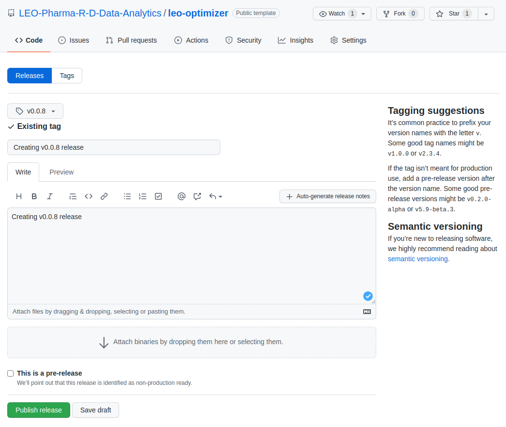

# Development Notes

## Setup

### docker-composer

This is preferable way of running this project in local / development environment.

```bash
docker-compose up -d
docker exec -it leo-optimizer-app bash
```

### docker

```bash
docker run --rm --name leo-optimizer-app -it -v $PWD:/src -w /src python:3.7-slim bash
```

## Installation

### Poetry

```bash
pip install --upgrade pip poetry
poetry update -vvv
poetry install

poetry run python
>>> from leo_optimizer.graphql import gql_optimizer
```

### Pip

```bash
pip install --upgrade pip
pip install -r /src/requirements.txt
pip install /src

python
>>> import leo_optimizer
>>> leo_optimizer.__version__
>>> from leo_optimizer.graphql import gql_optimizer
```

## Unit Test

```bash
poetry run tox
```

## Publishing

1. Version the package

    ```bash
    VERSION=0.0.8
    poetry version $VERSION
    sed -i "s/__version__.*/__version__ = '$VERSION'/g" leo_optimizer/__init__.py
    ```

1. Build package

    ```bash
    poetry build
    ```

1. Create GitHub Tag

    ```bash
    # Exit running container - executed in container
    exit
    # Executed on host OS
    git status
    git add .
    git commit --message 'Creating v0.0.8 release'
    git tag --annotate v0.0.8 --message 'Creating v0.0.8 release'
    git push origin v0.0.8
    ```

1. Create GitHub Release

    

1. Publish package

    **test.pypi.org**

    ```bash
    poetry config repositories.testpypi https://test.pypi.org/legacy/
    poetry publish -r testpypi -u <username> -p <password> --dry-run
    poetry publish -r testpypi -u <username> -p <password>
    ```

    **pypi.org**

    ```bash
    poetry publish -u <username> -p <password>
    ```
